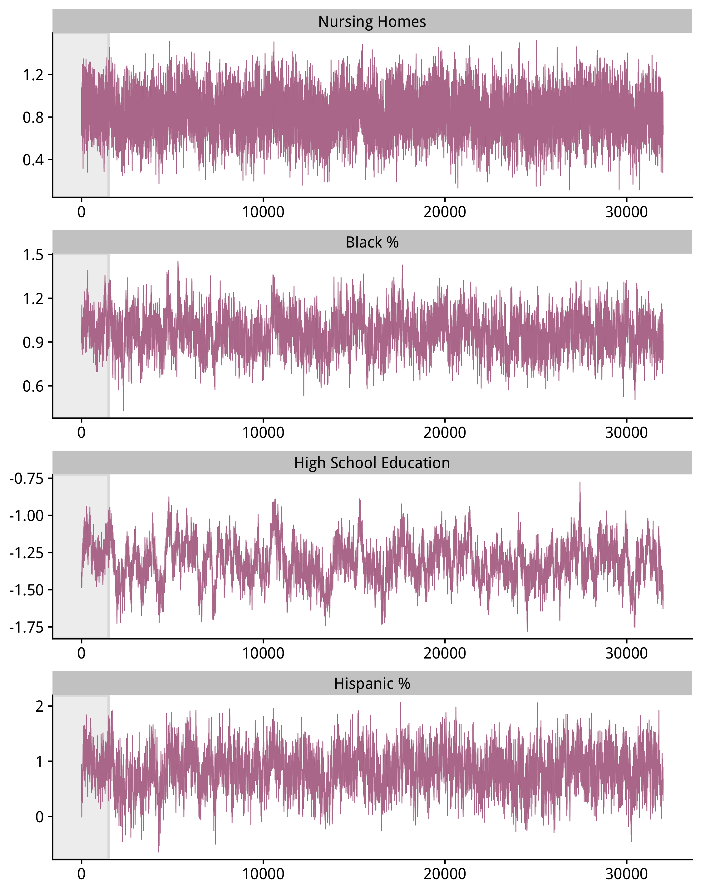
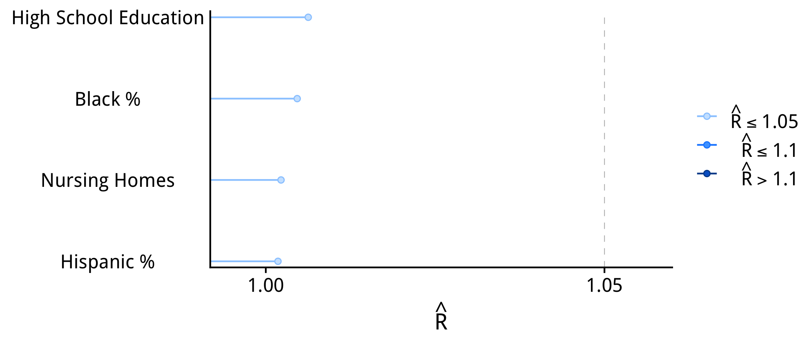
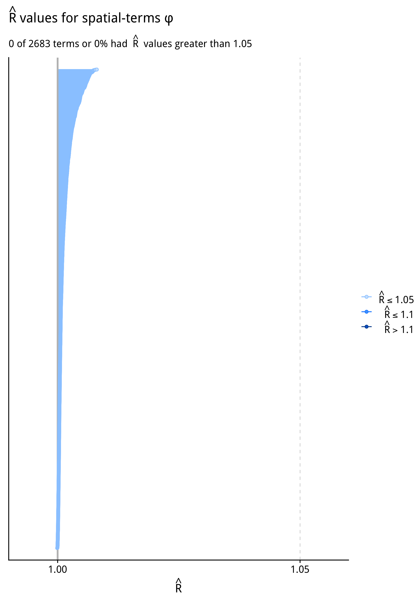
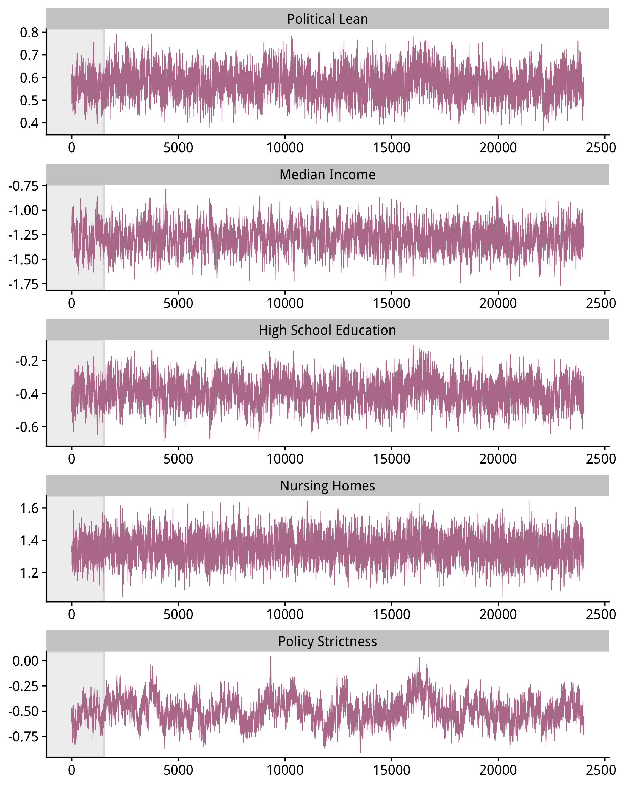
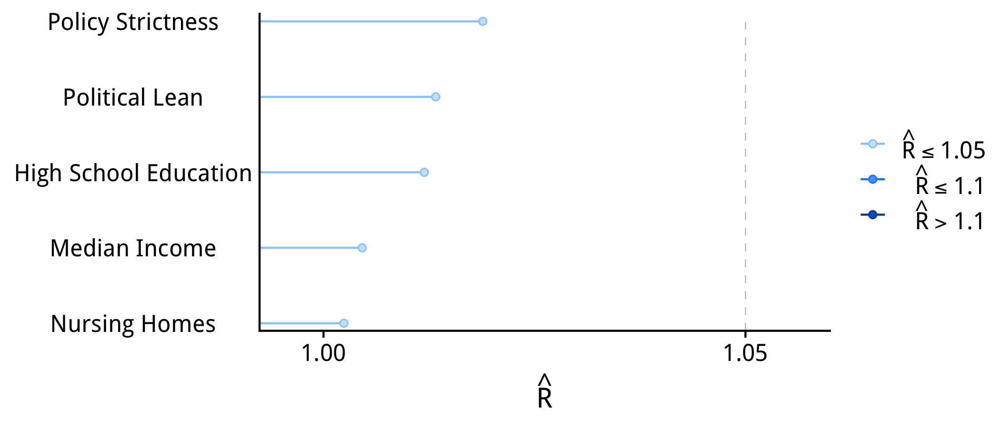
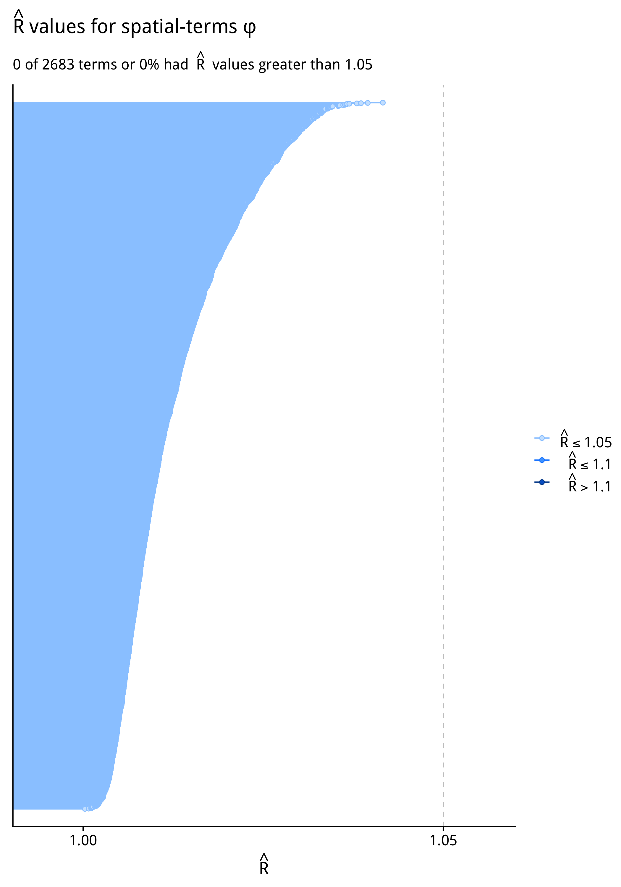

# Model Diagnostics

[Contemporary advice](https://mc-stan.org/rstan/reference/Rhat.html) is to only
use Monte Carlo Markov Chain based results after an R-hat convergence diagnostic
of 1.05 or less has been reached.

Below we show the traceplots for the main parameters and the convergence
diagnostics for every parameter in each of the models.

##### Period 2 

##### R-hat values for main effects

##### Period 3 

##### R-hat values for main effects

