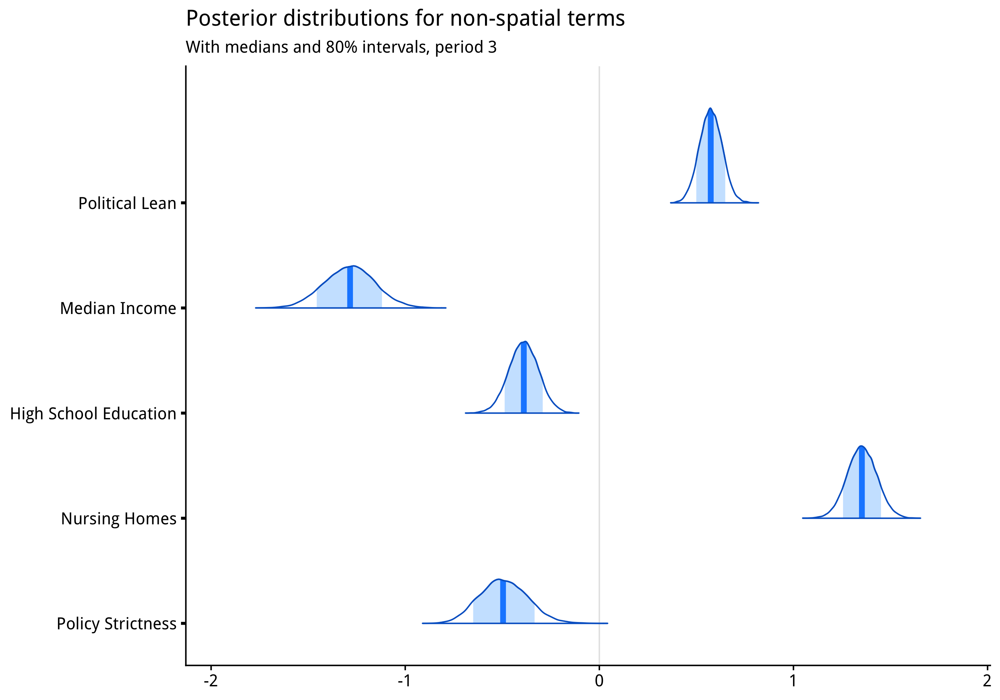

# A Spatial Auto-Regressive Poisson Model of COVID-19 County Death Rates in the United States

This project implements a sparse conditional autoregressive Poisson model that
predicts county COVID-19 death rates in the United States from county level features 
including:

- Percentage living in nursing homes
- Percentage Hispanic 
- Percentage Black
- Percentage with at least high school education 
- Median income
- Political lean from Democratic <-> Republican in the 2020 election
- Governor policy strictness

This work is intended as a supplement to our manuscript, *The Evolving Roles of
Partisanship and Vulnerability in the COVID-19 Pandemic*.

### Variable Selection 

We originally considered many more variables, but due to both the complexity of 
fitting a large spatial poisson model and the high correlation between many of 
the variables we have considered, we wanted to fit the spatial poisson model 
with only a small number of parameters. To select these in a parsimonious way, 
we tested parameters which appeared in the top 3 in terms of variable importance
in any of the LASSO or spatial linear regressions presented in our main manuscript.

### Results

The model results contained herein showed that the associations between 
the covariates mentioned above were robust even after accounting for 
spatial auto-correlation, or in other words the effect that counties which 
neighbor each other are expected to have similar outcomes. 

We estimated separate models for periods 2 (June 1 2020 to September 30 2020)
and 3 (October 1 2020 to February 12 2021).

#### Parameter Estimates 

#### Spatial Effects

Depicted below are the spatial effects estimated by the model in period 3.

#### Convergence Diagnostics

See the [diagnostics.md](diagnostics.md) file for a presentation of traceplots
and the R-hat convergence diagnostics.

#### References 

[Spatial Models in Stan: Intrinsic Auto-Regressive Models for Areal Data](https://mc-stan.org/users/documentation/case-studies/icar_stan.html)

[Spatial Models in Stan](https://mc-stan.org/workshops/dec2017/spatial_smoothing_icar.html)

[Exact Sparse CAR models in Stan](https://mc-stan.org/users/documentation/case-studies/mbjoseph-CARStan.html)

[GitHub repo for Exact Space CAR models in Stan](https://github.com/mbjoseph/CARstan)